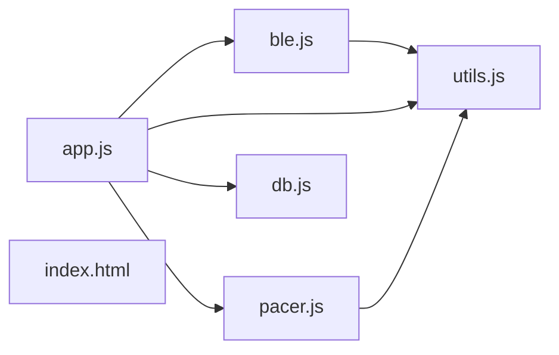

# Rowing Pacer v5.0

Rowing Pacer is a web-based Progressive Web App (PWA) designed to enhance indoor rowing workouts by providing real-time tracking and a visual/audio pacer. It connects directly to rowing machines via Bluetooth Low Energy (BLE) using the Fitness Machine Service (FTMS) standard.

---

## 🚀 Features

* **BLE Connectivity**: Seamlessly connects to rowing machines supporting the standard Bluetooth FTMS service.
* **Real-time Stats**: Tracks and displays Strokes Per Minute (SPM), Pace (/500m), Stroke Count, Distance, and Elapsed Time.
* **Dynamic Pacer**:
* Visual animation (rower dot) and audio beeps to help maintain target stroke rates.
* Adjustable target SPM (typically 16–32 SPM) with predefined drive and recovery timing curves.


* **Multiple Workout Modes**:
* **Time Goal**: Row for a specific duration.
* **Distance Goal**: Row for a specific distance.
* **Intervals**: Highly configurable intervals with specific distance/time and target SPM per segment.


* **Interval Anticipation**: Automatically transitions the pacer target slightly before an interval ends to help rowers adjust their rhythm early.
* **Workout History**: Saves completed workouts to local storage (IndexedDB), featuring detailed segment/interval breakdowns.
* **Redo Functionality**: Quickly restart any previous workout configuration from the history view.
* **Data Export**: Capability to save and export raw BLE rowing data logs for further analysis.
* **PWA Support**: Installable on mobile and desktop devices for offline access and a native-app feel.

---

## 🛠️ Tech Stack

* **Frontend**: HTML5, CSS3, Vanilla JavaScript (ES Modules).
* **Web Bluetooth API**: For real-time communication with fitness equipment.
* **IndexedDB**: Persistent local storage for workout history via a custom database wrapper (`db.js`).
* **Service Workers**: Provides offline capabilities and PWA functionality (`sw.js`).

---

## 📂 Project Structure

```text
.
├── css/
│   └── style.css          # Application styling and layout
├── js/
│   ├── app.js             # Main application logic and UI orchestration
│   ├── ble.js             # Bluetooth FTMS communication and data parsing
│   ├── db.js              # IndexedDB storage management for history
│   ├── pacer.js           # Pacer timing logic and animation control
│   └── utils.js           # Shared helper functions (formatting, audio, logs)
├── icons/                 # PWA icons
├── index.html             # Main entry point and UI structure
├── manifest.json          # Web App Manifest for PWA installation
└── sw.js                  # Service Worker for offline support

```

### File Dependencies

The following diagram illustrates the relationships between the source files:



---

## 🏁 Getting Started

### Prerequisites

* A browser that supports the **Web Bluetooth API** (e.g., Chrome, Edge, or Opera).
* A rowing machine that transmits data via the **Bluetooth FTMS** protocol.

### Local Setup

1. Clone the repository or download the source files.
2. Serve the files using a local web server (e.g., `Live Server` in VS Code or `python -m http.server`).
* *Note: Web Bluetooth requires a secure context (HTTPS or localhost).*


3. Open `index.html` in your browser.

---

## 📖 Usage

1. **Connect**: Click the **Connect BLE** button and select your rowing machine from the browser's device picker.
2. **Configure**: Choose a workout type (Time, Distance, or Intervals) and set your targets and stroke rates.
3. **Start**: Click **Ready to Row**. The app will automatically detect when you start rowing to begin the workout timer.
4. **Row**: Follow the visual rower dot and audio beeps to stay on pace.
5. **Review**: Once finished, your stats are saved to the **History** tab where you can view detailed segment data or redo the workout later.

---

## 📜 License

This project is intended for personal use. (Consult the repository owner for specific licensing details).
