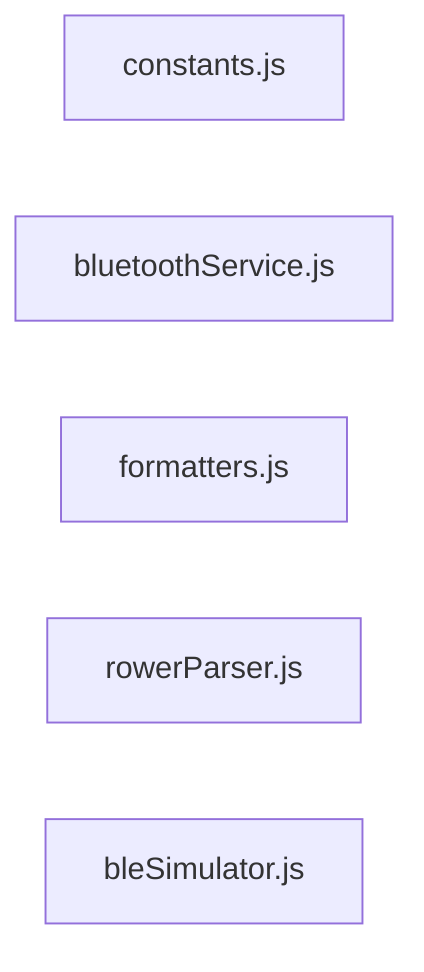
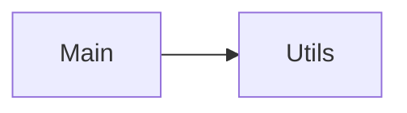

Repository Summary:
Files analyzed: 5
Directories scanned: 29
Total size: 21.96 KB (22482 bytes)
Estimated tokens: 5620
Processing time: 0.04 seconds


## Table of Contents

- [Project Summary](#project-summary)
- [Directory Structure](#directory-structure)
- [Files Content](#files-content)
  - Files By Category:
    - JavaScript/TypeScript (5 files):
      - [bleSimulator.js](#bleSimulator_js) - 12.9 KB
      - [bluetoothService.js](#bluetoothService_js) - 5.9 KB
      - [constants.js](#constants_js) - 233 bytes
      - [formatters.js](#formatters_js) - 727 bytes
      - [rowerParser.js](#rowerParser_js) - 2.2 KB
- [Architecture and Relationships](#architecture-and-relationships)
  - [File Dependencies](#file-dependencies)
  - [Class Relationships](#class-relationships)
  - [Component Interactions](#component-interactions)

## Project Summary <a id="project-summary"></a>

# Project Digest: rowing-pacer
Generated on: Sat Feb 28 2026 14:06:54 GMT+0800 (China Standard Time)
Source: c:\Users\sebas\OneDrive\dev\rowing-pacer\rowing-pacer
Project Directory: c:\Users\sebas\OneDrive\dev\rowing-pacer\rowing-pacer

# Directory Structure
[DIR] .
  [DIR] .git
  [DIR] .vscode
  [FILE] bleSimulator.js
  [DIR] bluetooth
    [FILE] bluetoothService.js
  [DIR] CodeFlattened_Output
  [DIR] utils
    [FILE] constants.js
    [FILE] formatters.js
    [FILE] rowerParser.js

# Files Content

## utils\constants.js <a id="constants_js"></a>

// utils/constants.js - Core configuration and workout templates

// Bluetooth UUIDs
export const FTMS_SERVICE_UUID = '00001826-0000-1000-8000-00805f9b34fb';
export const ROWER_DATA_CHAR_UUID = '00002ad1-0000-1000-8000-00805f9b34fb';
## bluetooth\bluetoothService.js <a id="bluetoothService_js"></a>

### Dependencies

- `../utils/constants.js`
- `../utils/rowerParser.js`
- `../utils/spmCalculator.js`

// bluetoothService.js - Rower BLE connection and data handling
// FIXED VERSION - Solves data jumping by handling packet flags correctly

import { FTMS_SERVICE_UUID, ROWER_DATA_CHAR_UUID } from '../utils/constants.js';
import { RowerParser } from '../utils/rowerParser.js';
import { SPMCalculator } from '../utils/spmCalculator.js';

let device, server, char;
let onDataCallback = null;

// SPM Calculator instance
const spmCalc = new SPMCalculator();

// Workout timing
let workoutStart = null;
let accumWorkoutMs = 0;

// Baseline tracking (Offset values)
let initialDistance = null;
let initialCals = null;

// Raw value persistence (Must track these because BLE packets are fragmented)
let lastRawDistance = null;
let lastRawCals = null;

// Reusable payload object to avoid GC pressure
const lastDataPayload = {
  spm: null,
  strokes: 0,
  distance: 0,
  pace: 0,
  watts: 0,
  cals: 0,
  time: 0,
  isActive: false,
  avgSpm: null,
  avgPace: null,
  avgWatts: null,
  calsPerHour: null,
  calsPerMinute: null
};

// Helper functions
function handleRowerData(event) {
  const arrayBuffer = event.target.value;
  const timestamp = performance.now();

  if (!arrayBuffer || arrayBuffer.byteLength < 2) return;

  // Parse using RowerParser
  const parsed = RowerParser.parse(arrayBuffer.buffer);

  // Skip if this is a fragmented packet
  if (parsed.moreData) return;

  // Process with SPM calculator
  const processed = spmCalc.processData(parsed, timestamp);

  // Get display strokes (already baseline-adjusted by spmCalc)
  const displayStrokes = spmCalc.getDisplayStrokes();

  // --- FIX START: Handle split packets for Distance & Calories ---

  // 1. Update Distance only if present in this packet
  if (processed.distance !== undefined) {
    lastRawDistance = processed.distance;

    // Set baseline on first VALID distance packet
    if (initialDistance === null) {
      initialDistance = lastRawDistance;
    }
  }

  // 2. Update Calories only if present in this packet
  if (processed.cals !== undefined) {
    lastRawCals = processed.cals;

    // Set baseline on first VALID calories packet
    if (initialCals === null) {
      initialCals = lastRawCals;
    }
  }

  // 3. Calculate display values
  // We use lastRawDistance (state) instead of processed.distance (packet)
  // because the current packet might not have distance data.
  const displayDist = (lastRawDistance !== null && initialDistance !== null)
    ? Math.max(0, lastRawDistance - initialDistance)
    : 0;

  const displayCals = (lastRawCals !== null && initialCals !== null)
    ? Math.max(0, lastRawCals - initialCals)
    : 0;

  // --- FIX END ---

  const displayPace = processed.paceSeconds || 0;
  const displayWatts = processed.watts || 0;
  const displaySPM = processed.spm;
  const isActive = processed.isActive || false;

  const elapsedFromRower = parsed.elapsedTime !== undefined
    ? parsed.elapsedTime * 1000
    : null;

  updateUI(
    displayStrokes,
    displayDist,
    displayPace,
    displayWatts,
    displayCals,
    displaySPM,
    isActive,
    elapsedFromRower,
    parsed
  );
}

function updateUI(strokes, dist, pace, watts, cals, spm, isActive, elapsedFromRower, parsed) {
  // Calculate elapsed time (prefer rower-provided time)
  const elapsed = elapsedFromRower !== null
    ? elapsedFromRower
    : accumWorkoutMs + (workoutStart ? performance.now() - workoutStart : 0);

  // Update properties of the existing object (avoid creating new object)
  lastDataPayload.spm = spm;
  lastDataPayload.strokes = strokes || 0;
  lastDataPayload.distance = dist || 0;
  lastDataPayload.pace = pace;
  lastDataPayload.watts = watts || 0;
  lastDataPayload.cals = cals || 0;
  lastDataPayload.time = elapsed;
  lastDataPayload.isActive = isActive;
  lastDataPayload.avgSpm = parsed?.avgSpm ?? null;
  lastDataPayload.avgPace = parsed?.avgPaceSeconds ?? null;
  lastDataPayload.avgWatts = parsed?.avgWatts ?? null;
  lastDataPayload.calsPerHour = parsed?.calsPerHour ?? null;
  lastDataPayload.calsPerMinute = parsed?.calsPerMinute ?? null;

  // Send to callback
  if (onDataCallback) {
    onDataCallback(lastDataPayload);
  }
}

// Exported functions
export async function connectRower(callback) {
  try {
    onDataCallback = callback;

    device = await navigator.bluetooth.requestDevice({
      filters: [{ services: [FTMS_SERVICE_UUID] }]
    });

    server = await device.gatt.connect();
    const service = await server.getPrimaryService(FTMS_SERVICE_UUID);
    char = await service.getCharacteristic(ROWER_DATA_CHAR_UUID);

    await char.startNotifications();
    char.addEventListener('characteristicvaluechanged', handleRowerData);

    console.log('[BLE] Connected to rower');
    return true;
  } catch (error) {
    console.error('[BLE] Connection failed:', error);
    throw error;
  }
}

export function disconnectRower() {
  if (char) {
    char.removeEventListener('characteristicvaluechanged', handleRowerData);
    char.stopNotifications().catch(err => console.error('[BLE] Stop notifications error:', err));
  }
  if (server && server.connected) {
    server.disconnect();
  }
  device = null;
  server = null;
  char = null;
  console.log('[BLE] Disconnected');
}

export function resetRowerSession() {
  spmCalc.reset();

  // Also reset internal time tracking
  workoutStart = null;
  accumWorkoutMs = 0;

  // Reset baselines
  initialDistance = null;
  initialCals = null;

  // FIX: Also reset raw trackers
  lastRawDistance = null;
  lastRawCals = null;

  // Reset the payload to ensure UI clears immediately
  lastDataPayload.spm = null;
  lastDataPayload.strokes = 0;
  lastDataPayload.distance = 0;
  lastDataPayload.pace = 0;
  lastDataPayload.watts = 0;
  lastDataPayload.cals = 0;
  lastDataPayload.time = 0;
  lastDataPayload.isActive = false;
  lastDataPayload.avgSpm = null;
  lastDataPayload.avgPace = null;
  lastDataPayload.avgWatts = null;
  lastDataPayload.calsPerHour = null;
  lastDataPayload.calsPerMinute = null;

  console.log('[BLE] Rower session reset');
}

## utils\formatters.js <a id="formatters_js"></a>

// formatters.js - Display formatting utilities

export function formatTime(seconds) {
  if (!seconds || seconds < 0) return '0:00';

  const mins = Math.floor(seconds / 60);
  const secs = Math.floor(seconds % 60);
  return `${mins}:${secs.toString().padStart(2, '0')}`;
}

export function formatPace(paceSeconds) {
  if (!paceSeconds || paceSeconds <= 0) return '--:--';

  const mins = Math.floor(paceSeconds / 60);
  const secs = Math.floor(paceSeconds % 60);
  return `${mins}:${secs.toString().padStart(2, '0')}`;
}

export function formatDistance(meters) {
  if (!meters || meters < 0) return '0';

  if (meters >= 1000) {
    return `${(meters / 1000).toFixed(2)}k`;
  }
  return Math.round(meters).toString();
}

## utils\rowerParser.js <a id="rowerParser_js"></a>

export const RowerParser = {
  parse(buffer) {
    const view = new DataView(buffer);
    const flags = view.getUint16(0, true);
    let offset = 2;
    const result = { moreData: (flags & 0x0001) !== 0 };

    // Stroke Rate & Count (when More Data = 0)
    if (!(flags & 0x0001)) {
      result.spm = view.getUint8(offset) * 0.5;
      result.strokes = view.getUint16(offset + 1, true);
      offset += 3;
    }

    // Average Stroke Rate (bit 1)
    if ((flags & 0x0002)) {
      result.avgSpm = view.getUint8(offset) * 0.5;
      offset += 1;
    }

    // Total Distance (bit 2) - UINT24
    if ((flags & 0x0004)) {
      result.distance = view.getUint8(offset) |
                       (view.getUint8(offset + 1) << 8) |
                       (view.getUint8(offset + 2) << 16);
      offset += 3;
    }

    // Instantaneous Pace (bit 3)
    if ((flags & 0x0008)) {
      result.paceSeconds = view.getUint16(offset, true);
      offset += 2;
    }

    // Average Pace (bit 4)
    if ((flags & 0x0010)) {
      result.avgPaceSeconds = view.getUint16(offset, true);
      offset += 2;
    }

    // Instantaneous Power (bit 5)
    if ((flags & 0x0020)) {
      result.watts = view.getInt16(offset, true);
      offset += 2;
    }

    // Average Power (bit 6)
    if ((flags & 0x0040)) {
      result.avgWatts = view.getInt16(offset, true);
      offset += 2;
    }

    // Resistance Level (bit 7) - unused, just skip
    if ((flags & 0x0080)) {
      offset += 2;
    }

    // Expended Energy (bit 8) - 3 fields!
    if ((flags & 0x0100)) {
      result.cals = view.getUint16(offset, true);
      result.calsPerHour = view.getUint16(offset + 2, true);
      result.calsPerMinute = view.getUint8(offset + 4);
      offset += 5;
    }

    // Heart Rate (bit 9)
    if ((flags & 0x0200)) {
      result.heartRate = view.getUint8(offset);
      offset += 1;
    }

    // Metabolic Equivalent (bit 10) - unused, just skip
    if ((flags & 0x0400)) {
      offset += 1;
    }

    // Elapsed Time (bit 11)
    if ((flags & 0x0800)) {
      result.elapsedTime = view.getUint16(offset, true);
      offset += 2;
    }

    // Remaining Time (bit 12) - unused, just skip
    if ((flags & 0x1000)) {
      offset += 2;
    }

    return result;
  }
};
## bleSimulator.js <a id="bleSimulator_js"></a>

// ==========================================
// BLE Rowing Pacer Simulator (FTMS-Compliant)
// ==========================================
(function() {
  console.clear();
  console.log("%c🚣 Rowing Pacer Simulator Loaded!", "color: #10b981; font-weight: bold; font-size: 16px;");
  console.log("Click 'Connect Rower' and 'Connect HR' in the app to start.");
  console.log("%c💡 Speed Control: Use SIM_SPEED_MULTIPLIER to adjust simulation speed", "color: #3b82f6; font-style: italic;");

  // Configuration
  const UPDATE_MS = 1000; // Base update interval (1 second in real-time)

  // Speed multiplier - increase to simulate faster
  // 1 = real-time, 5 = 5x faster, 10 = 10x faster, etc.
  window.SIM_SPEED_MULTIPLIER = 10; // Default to 10x speed

  // Calculate actual update interval based on speed
  function getUpdateInterval() {
    return UPDATE_MS / window.SIM_SPEED_MULTIPLIER;
  }

  // -----------------------------------------------------------------------
  // TIME ACCELERATION: Override setInterval to speed up app timers
  // -----------------------------------------------------------------------
  const originalSetInterval = window.setInterval;
  const originalClearInterval = window.clearInterval;

  // Track active intervals for cleanup
  const activeIntervals = new Map();
  let intervalIdCounter = 1;

  window.setInterval = function(callback, delay, ...args) {
    // Speed up intervals that are likely timers (around 50ms to 60s)
    // This catches the workout timer (1000ms) and zone tracking (1000ms)
    // but preserves very short intervals (UI animations) and very long ones
    let adjustedDelay = delay;
    if (delay >= 50 && delay <= 60000) {
      adjustedDelay = delay / window.SIM_SPEED_MULTIPLIER;
    }

    const id = originalSetInterval.call(this, callback, adjustedDelay, ...args);
    activeIntervals.set(intervalIdCounter, { id, originalDelay: delay, adjustedDelay });
    return intervalIdCounter++;
  };

  window.clearInterval = function(id) {
    const intervalInfo = activeIntervals.get(id);
    if (intervalInfo) {
      originalClearInterval.call(this, intervalInfo.id);
      activeIntervals.delete(id);
    }
  };

  console.log(`%c[Simulator] Time acceleration active: ${window.SIM_SPEED_MULTIPLIER}x speed`, "color: #f59e0b; font-weight: bold;");
  console.log(`[Simulator] App timers will run ${window.SIM_SPEED_MULTIPLIER}x faster`);

  // Simulation State
  const simState = {
    hr: 133,
    watts: 150,
    spm: 22,
    distance: 0,
    cals: 0,
    strokeCount: 0,
    elapsedSecs: 0,
    isRowing: true
  };

  // UUIDs (Must match constants.js)
  const UUIDS = {
    HR_SERVICE: '0000180d-0000-1000-8000-00805f9b34fb',
    HR_CHAR:    '00002a37-0000-1000-8000-00805f9b34fb',
    FTMS_SERVICE: '00001826-0000-1000-8000-00805f9b34fb',
    ROWER_CHAR:   '00002ad1-0000-1000-8000-00805f9b34fb'
  };

  // -----------------------------------------------------------------------
  // 1. Heart Rate Generator
  // -----------------------------------------------------------------------
  // Add a counter to your global state to track time/progress
  simState.counter = 0;

  function generateHRPacket() {
      // 1. Calculate the curve
      // We use Math.sin to get a value between -1 and 1
      // Adjust '0.05' to make the "up and down" faster or slower
      const intensity = Math.sin(simState.counter);

      // 2. Map -1...1 to the range 70...180
      // Midpoint is 125, Amplitude is 55 (125 +/- 55)
      simState.hr = Math.round(125 + (intensity * 55));

      // 3. Increment counter for the next packet
      simState.counter += 0.05;

      // Create the binary packet (same as before)
      const buffer = new ArrayBuffer(2);
      const view = new DataView(buffer);
      view.setUint8(0, 0);
      view.setUint8(1, simState.hr);

      return view;
  }

  // -----------------------------------------------------------------------
  // 2. Rower Data Generator (Matches FTMS Spec & Merach)
  // -----------------------------------------------------------------------
  function generateRowerPacket() {
    // --- Physics Simulation ---
    // Physics should NOT be multiplied by speed - the data represents real rowing
    // Only the rate at which data is sent changes with speed
    simState.watts = Math.max(100, Math.min(400, simState.watts + (Math.random() * 20 - 10)));
    const speedMS = Math.pow(simState.watts / 2.8, 1/3);

    // Distance accumulates at normal rate (per second of simulated time)
    simState.distance += speedMS;

    const calsPerHour = (simState.watts * 4 * 0.8604) + 300;
    // Calories accumulate at normal rate
    simState.cals += (calsPerHour / 3600);

    simState.spm = Math.max(18, Math.min(32, 24 + Math.sin(Date.now()/5000) * 4));

    // Stroke count at normal rate
    if (Math.random() < (simState.spm / 60)) {
        simState.strokeCount++;
    }

    // Elapsed time increments at normal rate (1 second per packet)
    simState.elapsedSecs++;

    const pace500 = speedMS > 0 ? (500 / speedMS) : 0;

    // --- FTMS Flags (Matching Merach 0x197E) ---
    const flags = 0x197E;

    const buffer = new ArrayBuffer(28);
    const view = new DataView(buffer);
    let offset = 0;

    // 1. Flags (UInt16)
    view.setUint16(offset, flags, true);
    offset += 2;

    // 2. Stroke Rate (UInt8) - Resolution 0.5 SPM
    view.setUint8(offset, Math.round(simState.spm * 2));
    offset += 1;

    // 3. Stroke Count (UInt16)
    view.setUint16(offset, simState.strokeCount, true);
    offset += 2;

    // 4. Average Stroke Rate (UInt8)
    view.setUint8(offset, Math.round(simState.spm * 2));
    offset += 1;

    // 5. Total Distance (UInt24)
    const d = Math.floor(simState.distance);
    view.setUint8(offset, d & 0xff);
    view.setUint8(offset + 1, (d >> 8) & 0xff);
    view.setUint8(offset + 2, (d >> 16) & 0xff);
    offset += 3;

    // 6. Instantaneous Pace (UInt16)
    view.setUint16(offset, Math.round(pace500), true);
    offset += 2;

    // 7. Average Pace (UInt16)
    view.setUint16(offset, Math.round(pace500 * 1.05), true);
    offset += 2;

    // 8. Instantaneous Power (SInt16)
    view.setInt16(offset, Math.round(simState.watts), true);
    offset += 2;

    // 9. Average Power (SInt16)
    view.setInt16(offset, Math.round(simState.watts * 0.95), true);
    offset += 2;

    // 10-12. Expended Energy (3 fields)
    view.setUint16(offset, Math.floor(simState.cals), true);
    offset += 2;
    view.setUint16(offset, Math.round(calsPerHour), true);
    offset += 2;
    view.setUint8(offset, Math.round(calsPerHour / 60));
    offset += 1;

    // 13. Heart Rate (UInt8)
    view.setUint8(offset, simState.hr);
    offset += 1;

    // 14. Elapsed Time (UInt16)
    view.setUint16(offset, simState.elapsedSecs, true);
    offset += 2;

    // 15. Remaining Time (UInt16)
    view.setUint16(offset, 0, true);
    offset += 2;

    return view;
  }

  // -----------------------------------------------------------------------
  // 3. Speed Control UI
  // -----------------------------------------------------------------------
  function createSpeedControl() {
    const controlDiv = document.createElement('div');
    controlDiv.style.cssText = `
      position: fixed;
      top: 10px;
      right: 10px;
      background: rgba(15, 23, 42, 0.95);
      border: 1px solid var(--slate-700, #334155);
      border-radius: 8px;
      padding: 12px;
      z-index: 10000;
      font-family: system-ui, -apple-system, sans-serif;
      box-shadow: 0 4px 12px rgba(0,0,0,0.3);
    `;

    controlDiv.innerHTML = `
      <div style="color: #94a3b8; font-size: 11px; text-transform: uppercase; margin-bottom: 6px; font-weight: 600;">
        Sim Speed
      </div>
      <div style="display: flex; gap: 4px; align-items: center;">
        <button id="sim-speed-1" class="sim-speed-btn" style="
          padding: 4px 8px;
          background: ${window.SIM_SPEED_MULTIPLIER === 1 ? '#10b981' : '#334155'};
          color: white;
          border: none;
          border-radius: 4px;
          font-size: 12px;
          cursor: pointer;
          font-weight: 600;
        ">1x</button>
        <button id="sim-speed-5" class="sim-speed-btn" style="
          padding: 4px 8px;
          background: ${window.SIM_SPEED_MULTIPLIER === 5 ? '#10b981' : '#334155'};
          color: white;
          border: none;
          border-radius: 4px;
          font-size: 12px;
          cursor: pointer;
          font-weight: 600;
        ">5x</button>
        <button id="sim-speed-10" class="sim-speed-btn" style="
          padding: 4px 8px;
          background: ${window.SIM_SPEED_MULTIPLIER === 10 ? '#10b981' : '#334155'};
          color: white;
          border: none;
          border-radius: 4px;
          font-size: 12px;
          cursor: pointer;
          font-weight: 600;
        ">10x</button>
        <button id="sim-speed-30" class="sim-speed-btn" style="
          padding: 4px 8px;
          background: ${window.SIM_SPEED_MULTIPLIER === 30 ? '#10b981' : '#334155'};
          color: white;
          border: none;
          border-radius: 4px;
          font-size: 12px;
          cursor: pointer;
          font-weight: 600;
        ">30x</button>
      </div>
      <div id="sim-status" style="color: #10b981; font-size: 10px; margin-top: 6px; text-align: center;">
        ${window.SIM_SPEED_MULTIPLIER}x speed
      </div>
    `;

    document.body.appendChild(controlDiv);

    // Add click handlers
    [1, 5, 10, 30].forEach(speed => {
      const btn = document.getElementById(`sim-speed-${speed}`);
      if (btn) {
        btn.onclick = () => {
          window.SIM_SPEED_MULTIPLIER = speed;
          updateSpeedControlUI();
          console.log(`[Simulator] Speed changed to ${speed}x`);
        };
      }
    });
  }

  function updateSpeedControlUI() {
    [1, 5, 10, 30].forEach(speed => {
      const btn = document.getElementById(`sim-speed-${speed}`);
      if (btn) {
        btn.style.background = window.SIM_SPEED_MULTIPLIER === speed ? '#10b981' : '#334155';
      }
    });
    const status = document.getElementById('sim-status');
    if (status) {
      status.textContent = `${window.SIM_SPEED_MULTIPLIER}x speed`;
    }
  }

  // -----------------------------------------------------------------------
  // 4. Bluetooth API Mocking
  // -----------------------------------------------------------------------
  class MockCharacteristic {
    constructor(uuid, service) {
      this.uuid = uuid;
      this.service = service;
      this.listeners = [];
      this.timer = null;
    }

    startNotifications() {
      console.log(`[Mock] Starting notifications for ${this.uuid} at ${window.SIM_SPEED_MULTIPLIER || 1}x speed`);

      const scheduleNextPacket = () => {
        const interval = getUpdateInterval();

        this.timer = setTimeout(() => {
          let packet = null;

          if (this.uuid === UUIDS.HR_CHAR) {
            packet = generateHRPacket();
          } else if (this.uuid === UUIDS.ROWER_CHAR) {
            packet = generateRowerPacket();
          }

          if (packet) {
            this.listeners.forEach(cb => cb({ target: { value: packet } }));
          }

          // Schedule next packet
          scheduleNextPacket();
        }, interval);
      };

      // Start the packet generation loop
      scheduleNextPacket();

      return Promise.resolve(this);
    }

    stopNotifications() {
      if (this.timer) {
        clearTimeout(this.timer);
        this.timer = null;
      }
      return Promise.resolve(this);
    }

    addEventListener(type, callback) {
      if (type === 'characteristicvaluechanged') {
        this.listeners.push(callback);
      }
    }

    removeEventListener(type, callback) {
      this.listeners = this.listeners.filter(l => l !== callback);
    }
  }

  class MockService {
    constructor(uuid, device) {
      this.uuid = uuid;
      this.device = device;
    }

    getCharacteristic(uuid) {
      return Promise.resolve(new MockCharacteristic(uuid, this));
    }
  }

  class MockDevice {
    constructor(name) {
      this.name = name;
      this.gatt = {
        connected: true,
        connect: () => {
          console.log(`[Mock] Connected to ${this.name}`);
          return Promise.resolve(this.gatt);
        },
        disconnect: () => {
          console.log(`[Mock] Disconnected from ${this.name}`);
        },
        getPrimaryService: (uuid) => {
          return Promise.resolve(new MockService(uuid, this));
        }
      };
    }
  }

  if (!navigator.bluetooth) navigator.bluetooth = {};

  navigator.bluetooth.requestDevice = (options) => {
    const isHR = options.filters.some(f => f.services.includes(UUIDS.HR_SERVICE));
    const deviceName = isHR ? "Mock HR Monitor" : "Mock Rower";
    console.log(`[Mock] Requesting device: ${deviceName}`);
    return Promise.resolve(new MockDevice(deviceName));
  };

  // Create speed control UI when DOM is ready
  if (document.readyState === 'loading') {
    document.addEventListener('DOMContentLoaded', createSpeedControl);
  } else {
    createSpeedControl();
  }

})();
## Code Visualization


### Architecture and Relationships

These diagrams visualize code relationships at different levels of abstraction.

### File Dependencies

This diagram shows dependencies between individual source files.

#

Below is a visualization of file dependencies in the codebase:



### Class Relationships

This diagram shows inheritance and associations between classes.

```mermaid
classDiagram
```




<!-- TEST VISUALIZATION MARKER -->


